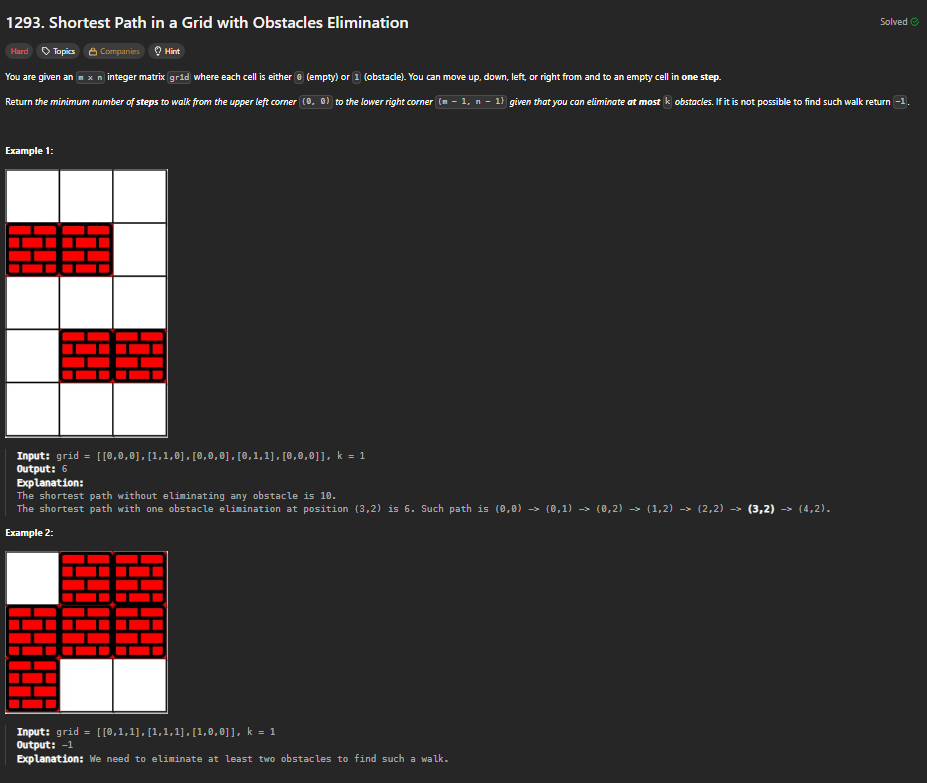
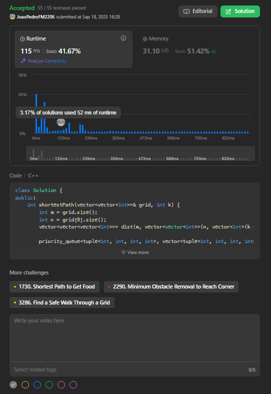

# Trabalho 1: Soluções de Desafios de Grafos (LeetCode)

**Disciplina**: Projeto de Algoritmos (FGA0124) 

**Professor**: Maurício Serrano

## 📖 Sobre o Projeto

Este repositório contém as soluções desenvolvidas para o **Trabalho 2** da disciplina de Projeto de Algoritmos. O objetivo principal foi aplicar e demonstrar o conhecimento teórico adquirido em aula através da resolução de desafios práticos da plataforma LeetCode.

Eu selecionei e implementei a solução para três problemas, sendo os três de nível **Difícil** , focando em diferentes algoritmos e estruturas de dados relacionadas a grafos.

## 👥 Equipe

| Matrícula  | Aluno                               |
| :--------- | :---------------------------------- |
| 231028989 | Joao Pedro Ferreira Moraes          |

## 🛠️ Tecnologias Utilizadas

- **Linguagem:** C++

## 🚀 Desafios Resolvidos

Abaixo estão detalhados os problemas abordados, com uma breve explicação da estratégia utilizada e o comprovante de submissão.

---
### 1. [1293. Shortest Path in a Grid with Obstacles Elimination](https://leetcode.com/problems/shortest-path-in-a-grid-with-obstacles-elimination/description/) - (Difícil)

#### **Estratégia:** 
A estratégia que eu utilizei foi uma variação do algoritmo de Dijkstra para encontrar o caminho mais curto. O principal ponto foi perceber que a localização (linha, coluna) não era suficiente para definir um estado, pois era crucial também saber quantos obstáculos já haviam sido eliminados.

Portanto, a solução define um "estado" mais complexo, representado por uma tupla:

`(linha, coluna, obstaculos_usados)`

Com base nisso, a lógica funciona assim:
- **1. Grafo de Estados:** O problema foi modelado como uma busca pelo caminho mais curto em um grafo de estados, onde cada nó é a tupla descrita acima. O objetivo é encontrar o caminho com o menor número de passos do estado inicial `(0, 0, 0)` até qualquer estado final `(m-1, n-1, k')`, onde `k'` seja menor ou igual a `k`.
- **2. Fila de Prioridade (Dijkstra):** Uma fila de prioridade foi usada para sempre explorar o estado que foi alcançado com o **menor número de passos** até o momento. Isso garante que, quando o destino é alcançado pela primeira vez, ele foi alcançado pelo caminho mais curto possível, que é a principal característica do algoritmo de Dijkstra.
- **3. Memorização de Distância:** Um array 3D `dist[linha][coluna][obstaculos_usados]` foi utilizado para registrar o menor número de passos necessários para chegar a cada estado específico. Isso evita explorar caminhos redundantes e piores, otimizando drasticamente a busca.

Em resumo, a estratégia transforma o problema de um simples labirinto 2D em um problema de busca 3D (onde a terceira dimensão é o número de eliminações usadas) e, em seguida, aplica o algoritmo de Dijkstra para encontrar o caminho mais curto de forma eficiente nesse espaço de estados expandido.

**Submissão:**
[Submissão LeetCode 1293](https://leetcode.com/problems/shortest-path-in-a-grid-with-obstacles-elimination/submissions/1775391876)

---

## 🎬 Vídeo de Apresentação

A explicação detalhada do raciocínio por trás de cada solução pode ser encontrada nos vídeos abaixo:

